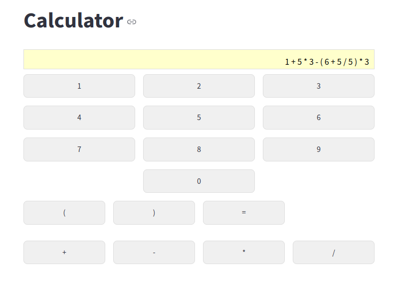
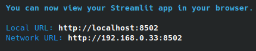

# Step-by-step calculator application

This is a toy project created to demonstrate the basic possibilities of Streamlit. The application is a simple
calculator allowing to perform arithmetic operations. The evaluation of these operations are performed step-by-step, in
the correct order of precedence. The user is allowed to input integers and perform +, -, * and / operations, as well as
add parenthesis.



## If you are learning to code...

... you can try adding the following features to the calculator as practice exercises:
- Adding a button to clear the input
- Implementing a backspace button
- Handling division by zero
- Implementing validate_expression algorithms instead of using eval
- Supporting floating point numbers in the input
- Handling the display of leading zeros
- Adding keyboard support
- Adding more operations (e.g. exponentiation)
- Adding a history of operations

You can also refactor the code, e.g. parametrize and move the helper functions from the main file to a separate module.

## How to run the application
- Clone the repository to your local machine
- Install Python 3.6 or higher, if you don't have it yet
- Create a virtual environment and activate it, e.g. using virtualenv. For Linux, you can use the following commands:
   - ```sudo apt install python3-venv```
   - ```python3 -m venv /path/to/your/venv```
   - ```source /path/to/your/venv/bin/activate```
  
  This is not the only way, so if you're doing it differently, then don't worry :)
- Install the required packages using pip: ```pip install -r requirements.txt```
- Run the application using Streamlit: ```streamlit run app.py```
- Open your browser and go to the address provided by Streamlit, e.g. http://localhost:8502

  